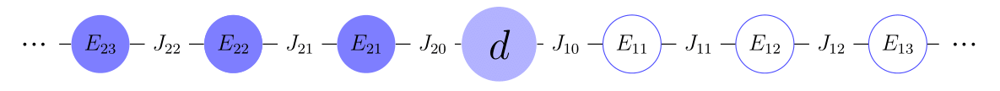
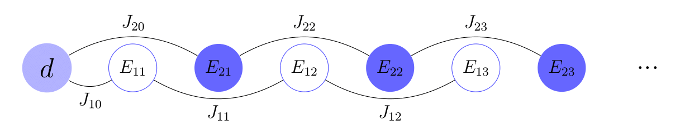
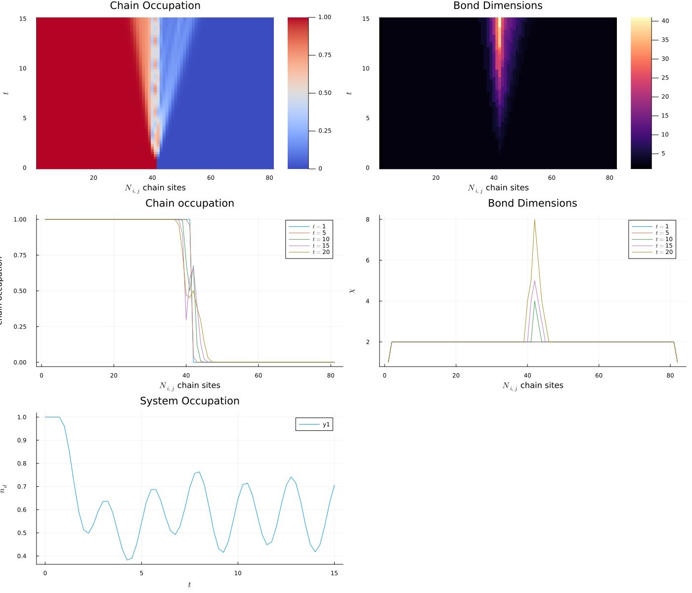

# The Anderson Impurity Model 

Here we give some context on the examples provided in `MPSDynamics/examples/anderson_model_double.jl` and `MPSDynamics/examples/anderson_model_interleaved.jl`. In these two examples, we use the fermionic chain mapping proposed in [^khon_efficient_2021] to show how to perform tensor network simulations of the [Single Impurity Anderson Model](https://en.wikipedia.org/wiki/Anderson_impurity_model) (SIAM) with the `MPSDynamics.jl` library. 


## Basics of the fermionic chain mapping

Before giving the code implementation, a short recap on the problem statement and on the fermionic mapping used to solved it. The SIAM Hamiltonian is defined as:

```math
    \hat H^\text{SIAM}  = \hat H_\text{loc} + \hat H_\text{hyb} + \hat H_\text{cond} = \overbrace{\epsilon_d \hat d^\dagger \hat d}^{\hat H_\text{loc}} + \underbrace{\sum_{k} V_k \Big( \hat d^\dagger \hat c_k + \hat c_k^\dagger \hat d \Big)}_{\hat H_\text{hyb}} + \underbrace{\sum_k \epsilon_k \hat c_k^\dagger \hat c_k}_{\hat H_\text{cond}}.
```

This Hamiltonian represents a located impurity ($\hat H_\text{loc}$), conduction electrons ($\hat H_\text{cond}$) and a hybridization term between the impurity and the conduction electrons ($\hat H_\text{hyb}$). All of the operators obey to the usual fermionic anti-commutation relations: $\{\hat c_i, \hat c_j^\dagger \} = \delta_{ij}$, $\{\hat c_i, \hat c_j \} =\{\hat c_i^\dagger, \hat c_j^\dagger \} =0$ $\forall i,j$. The chain mapping is based on a thermofield-like transformation 
[^devega_thermo_2015], performed with fermions: ancillary fermionic operators $\hat c_{2k}$ are defined, one for each of the original fermionic modes $\hat c_{1k}$. A Bogoliubov transformation is then applied, so that two new fermionic modes $\hat f_{1k}$ and $\hat f_{2k}$ are defined as a linear combination of $\hat c_{1k}$ and $\hat c_{2k}$. Two chains are defined: the chain labelled $1$ for the empty modes:
```math
\hat f_{1k}=e^{-iG}  \hat c_k e^{iG}= \cosh(\theta_k) \hat c_{1k} -\sinh(\theta_k)  \hat c_{2k}^\dagger \\
\hat f_{2k}=e^{-iG} \hat c_k e^{iG}= \cosh(\theta_k)  \hat c_{1k} +\sinh(\theta_k)  \hat c_{2k}^\dagger.
```
We remark that this is the same Bogoliubov transformation used in the thermofield[^devega_thermo_2015] for the bosonic case: the only thing that changes is a plus sign, that takes into account the fermionic anti-commutation relations. With these new fermionic operators we obtain the thermofield-transformed Hamiltonian, where the system interacts with two environments at zero temperature, allowing for pure state simulations (and thus the employement of MPS).

The thermofield-transformed Hamiltonian is then mapped on two chains, defined and constructed using the TEDOPA chain mapping: the chain labelled $1$ is for the empty modes, the chain labelled $2$ for the filled modes.
The following relations are used to define the functions equivalent to the spectral density of the bosonic case, one for each chain:
```math
\begin{aligned}
   &V_{1k} = V_{k} \sin \theta_k = \sqrt{\frac{1}{e^{\beta \epsilon_k}+1}} \\
   &V_{2k} = V_{k} \cos \theta_k = \sqrt{\frac{1}{e^{-\beta \epsilon_k}+1}}, 
\end{aligned}
```    
where we choose the spectral function that characterizes the fermionic bath to be: $V_k= \sqrt{1-k^2}$, and we define the dispersion relation as: $e_k = k$, that is, a linear dispersion relation with propagation speed equal to $1$. This latter choice corresponds to a model of metals (gapless energy spectrum). We select a filled state as the initial state of the defect.
Using the mapping proposed, the chain Hamiltonian becomes:
```math
    \begin{aligned}
    \hat H^\text{chain}  = \hat H_\text{loc} &+ \sum_{i = \{1,2\}}\bigg[ J_{i,0} \Big(\hat d^\dagger \hat a_{i,0} + \hat d \hat a_{i,0}^\dagger \Big) + \\ &+ \sum_{n=1}^\infty  \Big( J_{i,n} \hat a_{i,n}^\dagger \hat a_{i,n-1} +  J_{i,n} \hat  a_{i,n-1}^\dagger \hat a_{i,n} \Big) + \sum_{n=0}^\infty E_{i,n} \hat  a_{i,n}^\dagger \hat a_{i,n} \bigg],
    \end{aligned}
```
where the $J_{i,n}$ coefficients are the couplings between the chain sites and the $E_{i,n}$ coefficients are the energies associated to each chain site. Clearly, the interactions are between nearest neighbors. This, combined with the fact that the fermions in our model are spinless, enables a straightforward mapping into fermionic operators of the bosonic creation and annihilation operators, that on their part obey to the bosonic commutation relations: $[\hat b_i, \hat b_j^\dagger] = \delta_{ij}$, $[\hat b_i, \hat b_j] =[\hat b_i^\dagger, \hat b_j^\dagger] =0$ $\forall i,j$. The mapping derived from Jordan-Wigner transformations for spinless fermions is:
```math
    \hat a_{i}^\dagger \hat a_{i+1} + \hat a_{i+1}^\dagger \hat a_{i} = \hat b_{i}^\dagger \hat b_{i+1} + \hat b_{i+1}^\dagger \hat b_{i}.  
```


### Double chain MPO



We can represent the Hamiltonian $\hat H^\text{chain}$ as a MPOs bond dimension is: $\chi = 4$. The MPO has the structure of a double chain, with an impurty site at the center, and therefore can be seen as the product of the following matrices:
```math
    H = W_{1N} \cdot...\cdot W_{1 0} \cdot W_d \cdot W_{20} \cdot ... \cdot W_{2 N},  
```
where the matrices are defined as:
```math
\begin{aligned}
& W_{1N} = 
\begin{bmatrix}
\hat{\mathbb I} & J_{2,N} \hat b_{2,N}^\dagger & J_{2,N} \hat b_{2,N} & E_{2,N} \hat b_{2,N}^\dagger \hat b_{2,N} 
\end{bmatrix}, \quad   W_{1 0} = 
\begin{bmatrix}
 \hat{ \mathbb I} & J_{2,0} \hat b_{2,0}^\dagger & J_{2,0} \hat b_{2,0} & E_{2,0} \hat b_{2,0}^\dagger \hat b_{2,0}\\
0 &0 & 0 & \hat b_{2,0} \\
0 &0 & 0 & \hat b_{2,0}^\dagger \\
0 &0 & 0 & \hat{\mathbb I}
\end{bmatrix}, \\
& W_d = 
\begin{bmatrix}
 \hat{ \mathbb I} & \hat d^\dagger & \hat d & \epsilon_d \hat d^\dagger \hat d\\
0 &0 & 0 & \hat d \\
0 &0 & 0 & \hat d^\dagger \\
0 &0 & 0 & \hat{\mathbb I}
\end{bmatrix}\\ ,
& W_{2 0} =
\begin{bmatrix}
 \hat{ \mathbb I} & \hat b_{1,0}^\dagger & \hat b_{1,0} & E_{1,0} \hat b_{1,0}^\dagger \hat b_{1,0}\\
0 &0 & 0 & \hat J_{1,0}b_{1,0} \\
0 &0 & 0 & \hat J_{1,0}b_{1,0}^\dagger \\
0 &0 & 0 & \hat{\mathbb I}
\end{bmatrix}
, \quad W_{2 N} =
\begin{bmatrix}
 E_{2,N} \hat b_{2,N}^\dagger \hat b_{2,N} \\ J_{2,N} \hat b_{2,N} \\ J_{2,N} \hat b_{2,N}^\dagger \\ \hat{\mathbb I}
\end{bmatrix}.
\end{aligned}
```

### Interleaved chain MPO



The drawback of the double chain representation is that the particle-hole pairs are spatially separated in the MPS, creating correlations and therefore leading to a dramatic increase in the bond dimensions. This is why Kohn and Santoro propose an interleaved geometry, the advantages of which are thoroughly explained in [^khon_eff_2022]. Exploiting the interleaved representation, the interaction comes to be between next-nearest neighbors: a string operator appears in the Jordan-Wigner transformation from bosons to fermions:
```math
    \hat a_{i}^\dagger \hat a_{i+2} + \hat a_{i+2}^\dagger \hat a_{i} = \hat b_{i}^\dagger \hat F_{i+1} \hat b_{i+2} + \hat b_{i} \hat F_{i+1} \hat b_{i+2}^\dagger,
```
where the string operator $\hat F_i$ is defined as: $\hat F_i = (-1)^{\hat n_i} = \hat{\mathbb I} -2 \hat n_i = \hat{\mathbb I}-2 \hat b_i^\dagger \hat b_i$.  It is possible to find the analytical form also for MPOs with long range interaction. In the case of next-nearest neighbors interactions between spinless fermions, in the interleaved geometry of the figure above, the MPO representation will require a bond dimension $\chi=6$. We explicitly write it as:
```math
    H = W_{d} \cdot W_{2 0} \cdot W_{1 0} \cdot...\cdot W_{2N} \cdot W_{1 N},  
```
where the matrices are defined as: 

```math
\begin{aligned}
& W_d = 
\begin{bmatrix}
 \hat{\mathbb I} & \hat d & \hat d^\dagger & 0 & 0 & E_{d} \hat d^\dagger \hat d 
\end{bmatrix}, \quad W_{2 0} = 
\begin{bmatrix}
 \hat{ \mathbb I} & \hat b_{2,0} & \hat b_{2,0}^\dagger & 0 & 0 & E_{2,0} \hat b_{2,0}^\dagger \hat b_{2,0}\\
0 &0 & 0 & \hat{F}_{2,0} & 0 & J_{2,0} \hat b_{2,0}^\dagger \\
0 &0 & 0 & 0 & \hat{F}_{2,0} & J_{2,0} \hat b_{2,0} \\
0 &0 & 0 & 0 & 0 &  0\\
0 &0 & 0 & 0 & 0 & 0 \\
0 &0 & 0 & 0 & 0 & \hat{\mathbb I}
\end{bmatrix}, \\
& W_{1 0} = 
\begin{bmatrix}
 \hat{ \mathbb I} & \hat b_{1,0} & \hat b_{1,0}^\dagger & 0 & 0 & E_{1,0} \hat b_{1,0}^\dagger \hat b_{1,0}\\
0 &0 & 0 & \hat{ F}_{1,0} & 0 & 0 \\
0 &0 & 0 & 0 & \hat{F}_{1,0} & 0 \\
0 &0 & 0 & 0 & 0 & J_{1,0} \hat b_{1,0}^\dagger \\
0 &0 & 0 & 0 & 0 & J_{1,0} \hat b_{1,0} \\
0 &0 & 0 & 0 & 0 & \hat{\mathbb I}
\end{bmatrix}, \\
& W_{2,N} = 
\begin{bmatrix}
 \hat{ \mathbb I} & \hat b_{2,N} & \hat b_{2,N}^\dagger & 0 & 0 & E_{2,N} \hat b_{2,N}^\dagger \hat b_{2,N}\\
0 &0 & 0 & \hat{F}_{2,N} & 0 & 0 \\
0 &0 & 0 & 0 & \hat{F}_{2,N} & 0 \\
0 &0 & 0 & 0 & 0 & J_{2,N} \hat b_{2,N}^\dagger \\
0 &0 & 0 & 0 & 0 & J_{2,N} \hat b_{2,N} \\
0 &0 & 0 & 0 & 0 & \hat{\mathbb I}
\end{bmatrix}, 
\quad W_{1 N}
\begin{bmatrix}
 E_{1,N} \hat b_{1,N}^\dagger \hat b_{1,N} \\ 0 \\0 \\ J_{1,N} \hat b_{1,N}^\dagger \\ J_{1,N} \hat b_{1,N} \\ \hat{\mathbb I}
\end{bmatrix} .
\end{aligned}
```

## Code implementation

The fermionic mapping can be strightforwardly implemented with the methods of `MPSDynamics.jl`. We provide two examples: 
- `examples/anderson_model_double`, simulating the SIAM with the double-chain geometry
- `examples/anderson_model_interleaved`, simulating the SIAM with the interleaved-chain geometry
They only differ on the way the Hamiltonian MPO is defined. We now briefly review the important bits of the code.

Both of the examples start with the definition of the physical parameters,
```julia
N = 40      # number of chain sites
β = 10.0     # inverse temperature
μ = 0.      # chemical potential
Ed = 0.3    # energy of the impurity
ϵd = Ed - μ # energy of the impurity minus the chemical potential
```
The [`MPSDynamics.chaincoeffs_fermionic`](@ref) function is needed to compute the chain coefficients. It requires as inputs the number of modes of each chain `N`, the inverse temperature `β`, a label to specify if the chain modes are empty (label is `1.0`) or filled (label is `2.0`), and both the dispersion relation $\epsilon_k$ and the fermionic spectral density funciton $V_k$.
```julia
function ϵ(x)
    return x
end

function V(x)
    return sqrt(1 - x^2) # semi-circular density of states
end

chainparams1 = chaincoeffs_fermionic(N, β, 1.0; ϵ, V, save=false) # empty
chainparams2 = chaincoeffs_fermionic(N, β, 2.0; ϵ, V, save=false) # filled
```
We then specify the simulation parameters
```julia
dt = 0.25           # time step
T = 15.0            # simulation time
method = :DTDVP     # time-evolution method
Dmax = 150          # MPS max bond dimension
prec = 0.0001       # precision for the adaptive TDVP

```
and with this we are ready to construct the Hamiltonian MPO and specify the initial state, which will obviously differ depending on the chosen geometry.

#### Double chain geometry
The Hamiltonian is defined using the [`MPSDynamics.tightbinding_mpo`](@ref) function, which takes as an input the number of modes of each chain `N`, the defect's energy `ϵd`, and the chain coefficients of the first `chainparams1` and second `chainparams2` chain. The MPS for the initial state is a factorized state made of: N filled states, a filled impurity, and N empty states. 
```julia
H = tightbinding_mpo(N, ϵd, chainparams1, chainparams2)

ψ =  unitcol(2,2) # (0,1) filled impurity state
A = productstatemps(physdims(H), state=[fill(unitcol(2,2), N)..., ψ, fill(unitcol(1,2), N)...]) # MPS
```
To avoid the `DTDVP` algorithm from getting stuck in a local minimum, it is better to embed the MPS in a manifold of bond dimension 2 (or more):
```julia
mpsembed!(A, 2) # to embed the MPS in a manifold of bond dimension 2
```
We can now define the observables for the two chains and for the impurity
```julia
ob1 = OneSiteObservable("chain1_filled_occup", numb(2), (1,N))
ob2 = OneSiteObservable("chain2_empty_occup", numb(2), (N+2, 2N+1))
ob3 = OneSiteObservable("system_occup", numb(2), N+1)
```
and run the simulation
```julia
A, dat = runsim(dt, T, A, H;
                name = "Anderson impurity problem (folded chain)",
                method = method,
                obs = [ob1, ob2, ob3], 
                convobs = [ob1],
                params = @LogParams(N, ϵd, β),
                convparams = [prec],   
                Dlim = Dmax,          
                savebonddims = true,   # we want to save the bond dimension
                verbose = false,
                save = false,
                plot = true,
                );
```
With very minimal post-processing of the data
```julia
# Reshaping the vector to a column matrix and horizontal concatenation
system_occup_col = reshape(dat["data/system_occup"], :, 1)
occ = hcat(dat["data/chain1_filled_occup"]', system_occup_col)
occ = vcat(occ', dat["data/chain2_empty_occup"])
```
we plot the results:
```julia
# Plot the system occupation    
p1 = plot(
    dat["data/times"],
    dat["data/system_occup"],
    xlabel = L"$t$",
    ylabel = L"$n_d$",
    title = "System Occupation",
    size = (700, 500)
)

# Plot the occupation of the chain sites
p2 = heatmap(
    collect(1:2*N+1),
    dat["data/times"],
    transpose(occ),  # Use the matrix form
    cmap = :coolwarm,
    aspect_ratio = :auto,
    xlabel = L"$N_{i,j}$ chain sites",
    ylabel = L"$t$",
    title = "Chain Occupation",
    colorbar = true,
    size = (700, 500)
)

# Plot the bond dimensions
p3 = heatmap(
    collect(1:2*N+2),
    dat["data/times"],
    transpose(dat["data/bonddims"]),
    cmap = :magma,
    aspect_ratio = :auto,
    xlabel = L"$N_{i,j}$ chain sites",
    ylabel = L"$t$",
    title = "Bond Dimensions",
    colorbar = true,
    size = (700, 500)
)

# Define indices for columns to be plotted
columns_to_plot = [1, 5, 10, 15, 20]

# Plot vertical slices for occupancy
p4 = plot(title = "Chain occupation")
for col in columns_to_plot
    plot!(p4, occ[:, col], label = L"$t =$"*"$col", xlabel = L"$N_{i,j}$ chain sites", ylabel = "chain occupation")
end

# Plot vertical slices for bond dimensions
p5 = plot(title = "Bond Dimensions")
for col in columns_to_plot
    plot!(p5, dat["data/bonddims"][:, col], label = L"$t =$"*"$col", xlabel = L"$N_{i,j}$ chain sites", ylabel = L"$\chi$")
end

# Display the plots
plot(p2, p3, p4, p5, p1, layout = (3, 2), size = (1400, 1200))

```




#### Interleaved chain geometry
The Hamiltonian is defined using the [`MPSDynamics.interleaved_tightbinding_mpo`](@ref) function, which takes as an input the number of modes of each chain `N`, the defect's energy `ϵd`, and the chain coefficients of the first `chainparams1` and second `chainparams2` chain. The MPS for the initial state is a factorized state (bond dimension 1) made of: a filled impurity, and 2N alternate filled-empty states. 
```julia
H = interleaved_tightbinding_mpo(N, ϵd, chainparams1, chainparams2)

ψ =  unitcol(2,2) # (0,1) filled impurity state
Tot = Any[]
push!(Tot, ψ)
for i in 1:(N)
    push!(Tot, unitcol(2,2))
    push!(Tot, unitcol(1,2))
end

A = productstatemps(physdims(H), state=Tot) # MPS
```
To avoid the `DTDVP` algorithm from getting stuck in a local minimum, it is better to embed the MPS in a manifold of bond dimension 2 (or more):
```julia
mpsembed!(A, 2) # to embed the MPS in a manifold of bond dimension 2
```
We can finally define the observables for the interleaved chain
```julia
ob1 = OneSiteObservable("system_occup", numb(2), 1)
ob2 = OneSiteObservable("folded_chain_occup", numb(2), (2,2N+1))
```
and run the simulation
```julia
A, dat = runsim(dt, T, A, H;
                name = "Anderson impurity problem (folded chain)",
                method = method,
                obs = [ob1, ob2], 
                convobs = [ob1],
                params = @LogParams(N, ϵd, β),
                convparams = [prec],   
                Dlim = Dmax,          
                savebonddims = true,   # we want to save the bond dimension
                verbose = false,
                save = false,
                plot = true,
                );
```
To show the data in a clear way, we do a bit of post-processing of the data to _unfold_ the chain, and move back to the double chain representation:
```julia
unfolded_occ = Vector{Vector{Float64}}()  # Assuming the elements are of type Float64
unfolded_bonds = Vector{Vector{Float64}}()  # Adjust the type based on actual data

# Populate unfolded_occ by iterating in the specific order mentioned
for i in 1:N  # Adjusted for 1-based indexing
    push!(unfolded_occ, dat[ "data/folded_chain_occup"][2N + 1 - 2i, :])
end

push!(unfolded_occ, dat["data/folded_chain_occup"][1,:])

for i in 2:N
    push!(unfolded_occ, dat["data/folded_chain_occup"][2i,:])
end

# Populate unfolded_bonds similarly
for i in 1:(N+1)  # Adjusted for 1-based indexing
    push!(unfolded_bonds, dat["data/bonddims"][2N + 3 - 2i,:])  # Assuming bonddims is directly accessible
end

push!(unfolded_bonds, dat["data/bonddims"][1,:])

for i in 2:(N+1)
    push!(unfolded_bonds, dat["data/bonddims"][2i,:])
end

unfolded_bonds_matrix = hcat(unfolded_bonds...)'
unfolded_occ_matrix = hcat(unfolded_occ...)'
```
We conclude by plotting the data
```julia
# Plot the system occupation    
p1 = plot(
    dat["data/times"],
    dat["data/system_occup"],
    xlabel = L"$t$",
    ylabel = L"$n_d$",
    title = "System Occupation",
    size = (700, 500)
)

# Plot the occupation of the chain sites
p2 = heatmap(
    collect(1:2*N),
    dat["data/times"],
    transpose(unfolded_occ_matrix),  # Use the matrix form
    cmap = :coolwarm,
    aspect_ratio = :auto,
    xlabel = L"$N_{i,j}$ chain sites",
    ylabel = L"$t$",
    title = "Chain Occupation",
    colorbar = true,
    size = (700, 500)
)

# Plot the bond dimensions
p3 = heatmap(
    collect(1:2*N+2),
    dat["data/times"],
    transpose(unfolded_bonds_matrix),
    cmap = :magma,
    aspect_ratio = :auto,
    xlabel = L"$N_{i,j}$ chain sites",
    ylabel = L"$t$",
    title = "Bond Dimensions",
    colorbar = true,
    size = (700, 500)
)

# Define indices for columns to be plotted
columns_to_plot = [1, 5, 10, 15, 20]


# Plot vertical slices for occupancy
p4 = plot(title = "Chain occupation")
for col in columns_to_plot
    plot!(p4, unfolded_occ_matrix[:, col], label = L"$t =$"*"$col", xlabel = L"$N_{i,j}$ chain sites", ylabel = "chain occupation")
end

# Plot vertical slices for bond dimensions
p5 = plot(title = "Bond Dimensions")
for col in columns_to_plot
    plot!(p5, unfolded_bonds_matrix[:, col], label = L"$t =$"*"$col", xlabel = L"$N_{i,j}$ chain sites", ylabel = L"$\chi$")
end

# Display the plots
plot(p2, p3, p4, p5, p1, layout = (3, 2), size = (1400, 1200))
```


________________
## Bibliography

[^khon_efficient_2021]: 
    > Kohn, L.; Santoro, G. E. Efficient mapping for anderson impurity problems with matrix product states. Phys. Rev. B 2021, 104 (1), 014303. https://doi.org/10.1103/PhysRevB.104.014303.

[^devega_thermo_2015]:
    > de Vega, I.; Banuls, M-.C. Thermofield-based chain-mapping approach for open quantum systems. Phys. Rev. A 2015, 92 (5), 052116. https://doi.org/10.1103/PhysRevA.92.052116.

[^khon_eff_2022]:
    > Kohn L.; Santoro G. E. J. Stat. Mech. (2022) 063102 DOI 10.1088/1742-5468/ac729b.
    
