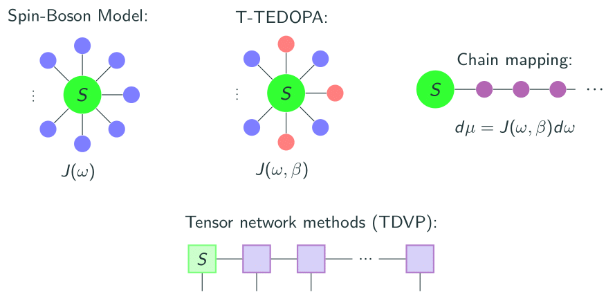

# MPSDynamics for open quantum systems in a nutshell

MPSDynamics was originally developed to perform tensor network simulations of open quantum systems, modelled by the Spin-Boson model. The key idea to construct the simulations is to reformulate the open quantum system Hamiltonian as a one-dimensional many-body problem with nearest-neighbor interactions. The dynamics are then efficiently simulated with tensor network methods. 

The idea is to start from the Spin-Boson model, where the coupling between system and environment is specified by the spectral density function $J(\omega)$. At finite temperature, the initial state of the environment will be a thermal state (mixed), making the problem intractable. To circumvent this issue, we consider instead an _extended environment_, with coupling to the system characterized by a thermalized spectral density function $J(\omega,\beta)$. The vacuum state (pure) of the extended environment corresponds to the thermal state of the original environment. The two environments induce the same reduced dynamics on the system, enabling us to deal with pure states only. To exploit the matrix product states description, we apply a unitary transformation, dependent on $J(\omega,\beta)$, to the Spin-Boson Hamiltonian, mapping it on a chain Hamiltonian with nearest-neighbor interactions. This enables efficient representation and time evolution with matrix product states (MPS) methods.

